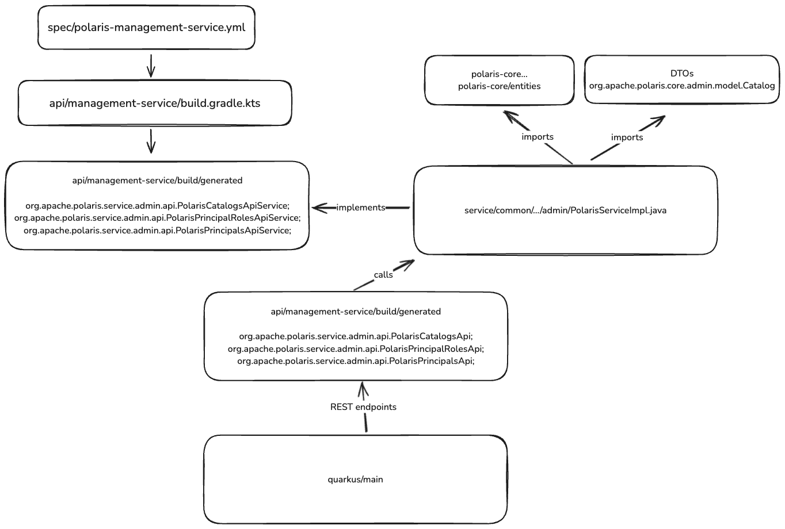

# polaris-boot

Infrastructure for booting an instance of Apache Polaris that runs locally or in S3 using Spark

## Prerequisuites:
1. Install task
2. Clone the polaris repository and build the docker image
```bash
git clone https://github.com/msc-open-metadata/polaris.git ..

task docker:build:polaris-local
```

3. Clone and build the spark repository
```bash
git clone https://github.com/apache/spark.git ..
# Switch to 3.5
# git checkout branch-3.5

task docker:build:spark
```


## Adding a new endpoint to Polaris:


1.Build project and generate API
```bash
./gradlew assemble
```

2.Add object and endpoint yaml specification to spec/polaris-management-service.yml

3.

Overview:

